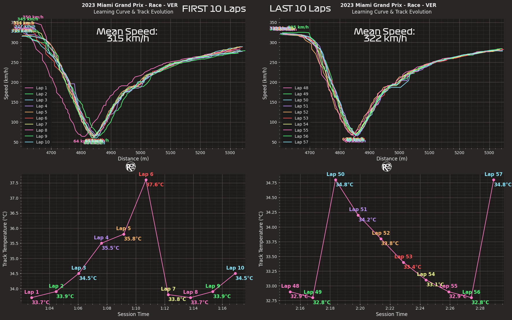
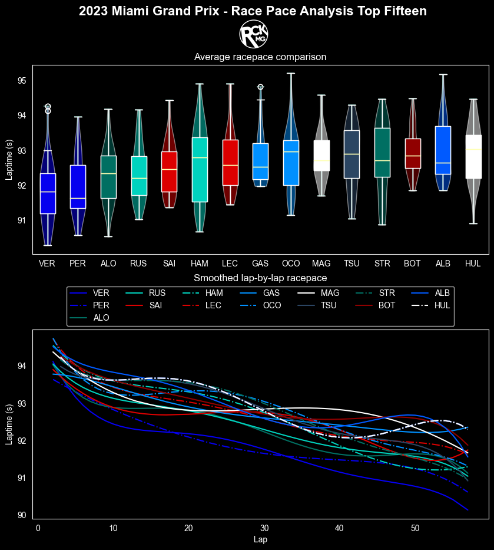
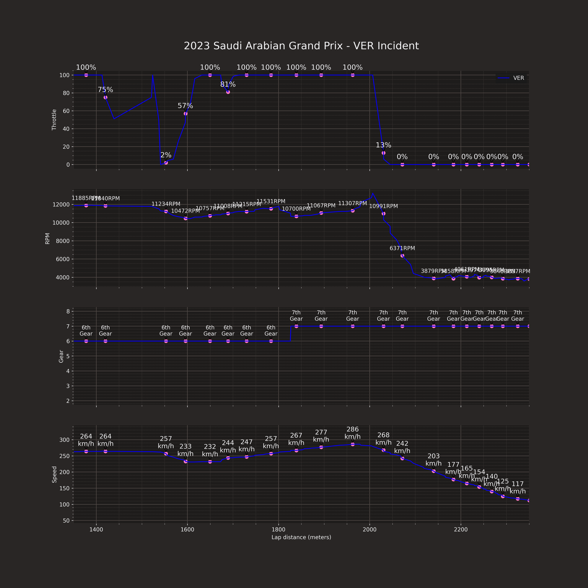

# F1 Data Visualization

This repository contains various data visualization scripts and resources related to Formula 1 racing.




## Directory Structure

- `.idea` - IDE settings
- `Cache` - Cached data used in the project
- `CircuitMaps+Turns` - Circuit maps and turn data (Azerbaijan data is not complete)
- `Default` - Visualizations that get posted regularly
- `ForFastestLaps` - Visualization for the fastest laps
- `LapSpecific` - Lap-specific visualizations (Azerbaijan data is not complete)
- `Tests` - Test files and scripts
- `AustralianGP.psd` - Australian Grand Prix related resources
- `RCKMG_logo.png` - Logo used in the visualizations

## Getting Started

1. Clone the repository
2. Install required dependencies
3. Run the desired visualization script

## Dependencies

This project uses various Python libraries for data manipulation and visualization. Here is a list of the main dependencies used in this project:

- `fastf1` - For fetching and processing Formula 1 data
- `pandas` - For data manipulation and analysis
- `numpy` - For numerical computing
- `matplotlib` - For creating static, animated, and interactive visualizations
- `plotly` - For interactive data visualization
- `seaborn` - For statistical data visualization
- `Pillow` - For image processing

To install these dependencies, run the following command in your terminal:

```bash
pip install -r requirements.txt
